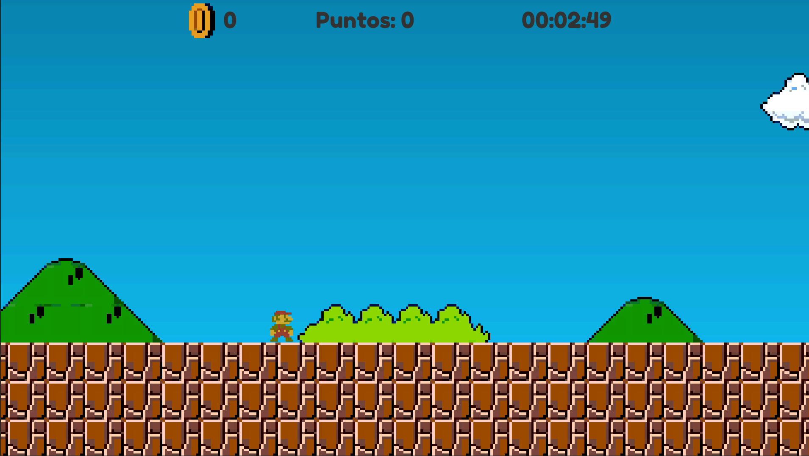
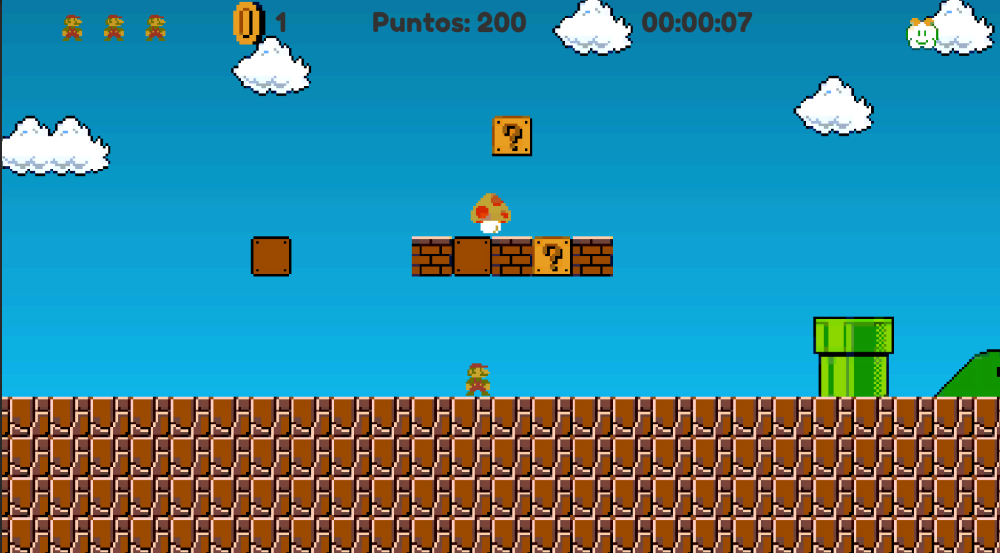
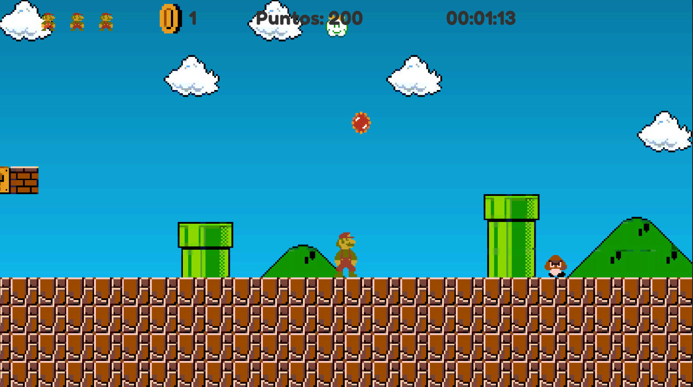
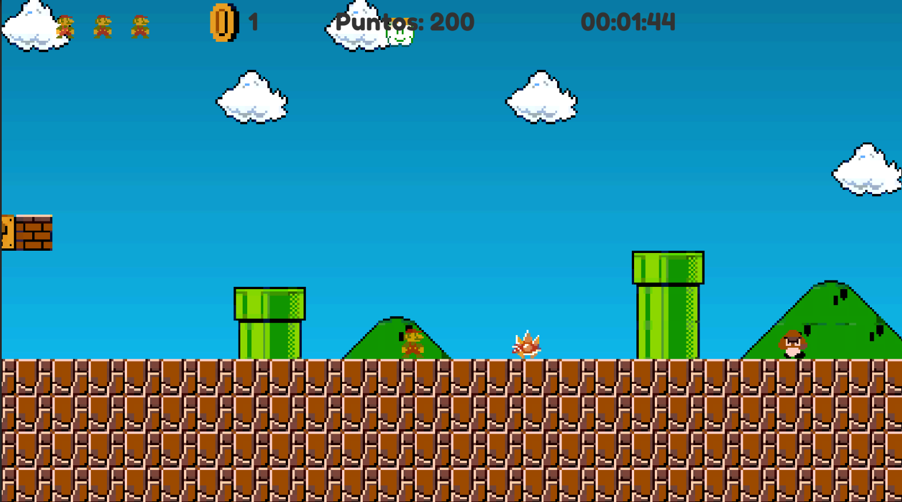

# PEC3 - A Platform Game v2

## Description

A recreation of level 1-1 from the classic game "Super Mario Bros." The goal was to maintain the game feeling of Mario's movement. Original assets have been used to improve the presentation.

## Implemented Sections

The PAC2 was taken up again and expanded. Missing optional behaviors (the mushroom and the destruction of brick blocks in this state) have been implemented. Additionally, the PEC3 requirements have been added, such as 2 new types of enemies (the cloud enemy and the red hedgehog), lives, various checkpoints, and particles have been used in the flowers and fireballs. The fire flower and additional animations have also been added to the game. Tags and layers are used, although in some cases they were already used in PAC2.

## How to Play

The game can be controlled with a keyboard or game controller using Unity's new Input System. The controls are as follows:

Keyboard:

- A and D keys / arrow keys to move horizontally
- Space to jump
- Shift to move faster
- E to shoot the fireball (Only with the flower)

Game Controller (Xbox):

- Left joystick to move horizontally
- A to jump
- X to move faster
- B to shoot the fireball (Only with the flower)

## Screenshots and Video

Video: https://youtu.be/MLYnfunWaFQ

## Implementation
The classes implemented in PEC2 are maintained, although certain functionalities have been expanded. Here are the changes from PAC2:

### PlayerController Class
Logic for big Mario and fire Mario states has been added. Certain code was refactored to allow lives and checkpoints. The number of Mario animations has been significantly expanded since the hitbox change is made from the Animator. Therefore, additional animator variables have been added to the code.

### BrickBlock and QuestionMarkBlock Classes
The destruction of bricks has been added if Mario is big. QuestionMarkBlocks have been expanded to allow power-ups.

### CameraFollower Class
The camera has been adapted for respawn cases.

### EndGameTrigger Class
The class has been adapted for respawn cases.

### FallTrigger Class
The class has been adapted for respawn cases.

### FireballScript Class
New class to control the behavior of Mario's fireballs with the flower. It moves to the side it is thrown until it hits either an enemy or a wall. If it is an enemy, it destroys it.

### MushroomScript Class
New class to control the behavior of mushrooms. It behaves like a goomba in that it moves until it hits a wall. However, in this case, the direction will always be to the right to favor Mario picking them up.

### CloudEnemyController Class
New class, controller for the new cloud-shaped enemy. Follows Mario and, if above him, generates red hedgehog-type enemies every so often.

### FallEnemyController Class
New class, controller for the new "FallEnemy" red hedgehog-shaped enemy. These enemies cannot be defeated by jumping on them due to their spikes. They can only be defeated with fireballs. They fall vertically until they touch the ground. Once on the ground, they behave like Goombas, moving in a random direction until they hit a wall.

### CurrentLivesUIController Class
New class, controller for the user interface to display Mario's remaining lives. The lives Mario has are considered with the nLives variable of PlayerController.

### GoalScript, HUDManager, AudioManager, GoombaController Classes
No changes

## Developers

- Francisco José Palacios Márquez

## Third-Party Resources

Sprites - https://www.spriters-resource.com/nes/supermariobros/

Sound effects - https://themushroomkingdom.net/media/smb/wav

Music - https://downloads.khinsider.com/game-soundtracks/album/super-mario-bros
